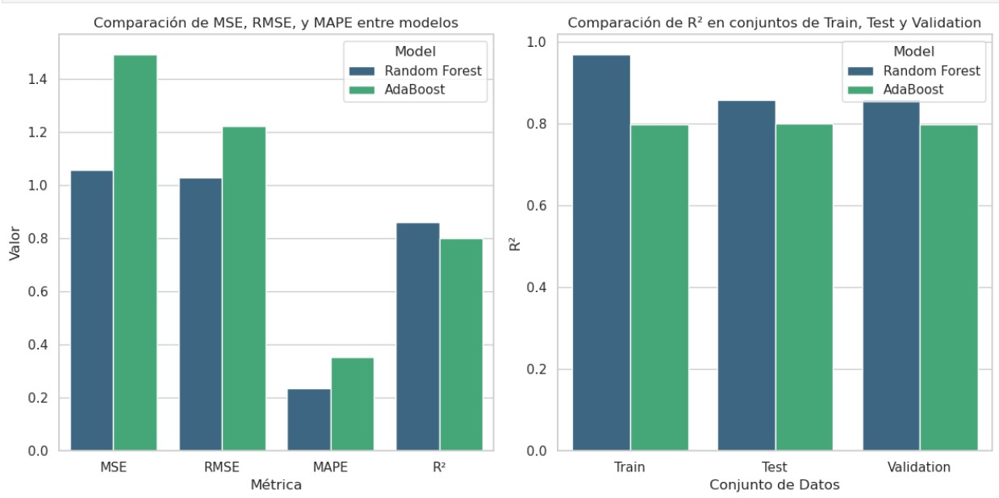
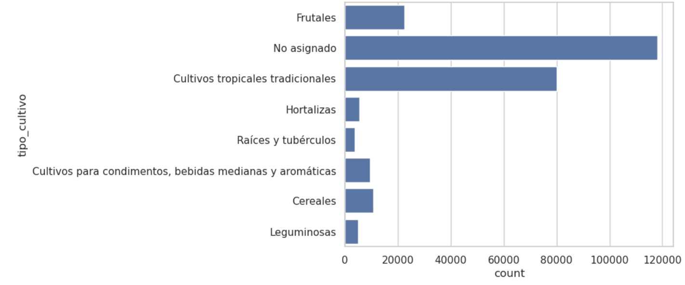

# **Conclusiones para modelo: Análisis de Correlación para Entender la Relación Entre Precios de Insumos y Exportaciones**

Observemos los resultados de los scores y las métricas tomadas en cuenta:

**Para la Regresión Lineal con Regularización de Ridge:**

```
**********Scores y resultados para Regularización de Ridge**********
Training set score: 0.20
Test set score: 0.21
Validation set score: 0.20

MSE para Ridge en el conjunto de prueba: 5.9454
RMSE para Ridge en el conjunto de prueba: 2.4383
MAPE para Ridge en el conjunto de prueba: 0.6659

```

**Para Random Forest:**

```
**********Scores y resultados para Random Forest**********
Training set score: 0.97
Test set score: 0.86
Validation set score: 0.86

MSE para Random Forest en el conjunto de prueba: 1.0562
RMSE para Random Forest en el conjunto de prueba: 1.0277
MAPE para Random Forest en el conjunto de prueba: 0.2360
R² para Random Forest en el conjunto de prueba: 0.8588

```

**Para AdaBoost:**

```
**********Scores y resultados para AdaBoost**********
Training set score: 0.80
Test set score: 0.80
Validation set score: 0.80

MSE para AdaBoost en el conjunto de prueba: 1.4918
RMSE para AdaBoost en el conjunto de prueba: 1.2214
MAPE para AdaBoost en el conjunto de prueba: 0.3521
R² para AdaBoost en el conjunto de prueba: 0.8006
```
De una forma más visual:



Los resultados obtenidos respaldan nuestra hipótesis de que las técnicas de machine learning son necesarias para modelar de manera efectiva el impacto de los precios de los insumos agrícolas en las exportaciones de cultivos. La regresión lineal tradicional no fue capaz de capturar ni siquiera en un porcentaje mínimo las relaciones complejas y no lineales entre las variables, lo que llevó a un desempeño deficiente en comparación con los modelos más sofisticados.

Por otro lado, tanto Random Forest como AdaBoost mostraron un rendimiento significativamente mejor, lo que sugiere que estos modelos pueden identificar relaciones complejas entre los insumos y las exportaciones que no son evidentes a través de enfoques lineales. **Sin embargo, es importante subrayar que el objetivo no es tanto predecir de manera exacta el valor de las exportaciones, sino más bien identificar si existen relaciones significativas entre las variables y cómo esas relaciones se pueden modelar eficazmente con técnicas de machine learning.**


Es importante aclarar de nuevo que este modelo de ML que se realizó se limitó **a un grupo pequeño del sector agricultor**, el sector que tiene información sobre los cultivos. Si observamos la siguiente gráfica, vemos que la mayoría de exportaciones no tenían asignado ningún tipo de cultivo ya que este resto de procutos no tenían una categoría en el dataset de *Evaluaciones Agropecuarias Municipales – EVA. 2019 - 2023. Base Agrícola*.




La categoría con mayor cantidad de datos en la base de exportaciones, después de `No asignado`, es `Cultivos tropicales tradicionales`. Esta proporción indica que la asignación de `tipo_cultivo` en las exportaciones refleja adecuadamente la importancia de estos cultivos. Gracias a los buenos resultados de los puntajes (scores) obtenidos en los modelos, **podemos afirmar que estamos prediciendo correctamente la proporción de exportaciones entre los siete tipos de cultivo registrados en la otra base de datos**. Además, si observamos el análisis exploratorio de datos (EDA) que se realizó para esa base base de datos, vemos que se muestra que estos tipos de cultivos son predominantes en las distintas regiones del país, lo que sugiere que la generalización lograda en los modelos se aproxima bien a la realidad del sector agrícola en el país.

Este análisis demuestra que los modelos no lineales, como Random Forest y AdaBoost, son herramientas poderosas para descubrir patrones e interacciones más complejas entre las variables, lo que los hace particularmente útiles en este tipo de estudios económicos y agrícolas.
