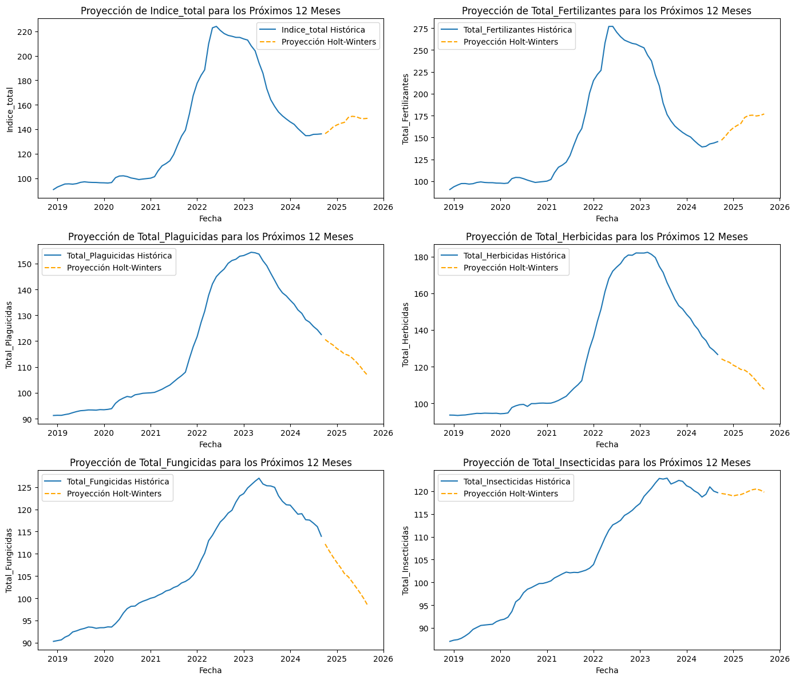

# Resultados y conclusiones del modelo Holt-Winters

Después del análisis exploratorio de los datos de las colocaciones para créditos agropecuarios, se encontró un gran potencial para un modelo de Machine Learning basado en series de tiempo para observar tendencias estacionales, de modo que fuera posible indicar a futuro periodos en los que se realiza la mayor cantidad de colocaciones de crédito para así llevar a cabo planeaciones de presupuesto adecuadas. Dado que se tienen datos entre 2021 y 2024, esto da como resultado una serie con datos limitados, sin embargo, se optó por usar el modelo de Holt-Winters, en cual permite captar tendencias estacionales en series cortas, que es justo lo que se espera obtener para estos datos. Adicionalmente, este modelo también capta tendencias generales en los datos, es decir, un aumento o diminución general, que también es posible reconocer con los datos que se están tratando.

Similarmente para el conjunto de datos de los índices relacionados con los precios agrícolas, la organización de los datos es bastante útil puesto que los índices se dividen por meses entre 2019 y 2024.

En el archivo `Modelo_HW.ipynb` dentro de esta misma carpeta se encuentra todo el desarrollo del código para la implementación de los modelos.

Es posible observar que el modelo toma la caída de las colocaciones al inicio del año, las cuales siempre están seguidas por una considerable subida, para luego estabilizarse un poco durante la mitad del año y al final volver a tener una subida considerable. Esto da a entender que el modelo fue eficaz al momento de determinar los patrones específicos para cada mes y puede llegar a ser una herramienta valiosa al planear distribuciones de presupuesto para financiamientos del sector agropecuario.

Adicionalmente, para el conjunto de datos de los índices relacionados a precios agrícolas se hizo un procedimiento similar, pero en este caso, para fines demostrativos se decidió tomar 6 índices: el índice total de los insumos, de fertilizantes, plaguicidas, herbicidas, fungicidas e insecticidas. Con cada uno se realizó una serie de tiempo y se obtuvo la proyección para el siguiente año. Con la característica de que estos índices no parecían presentar una tendencia estacionaria tan clara entre meses, de igual forma el modelo fue capaz de determinar una proyección coherente gracias al componente de tendencia que puede captar. En la siguiente imagen se encuentran las proyecciones:

